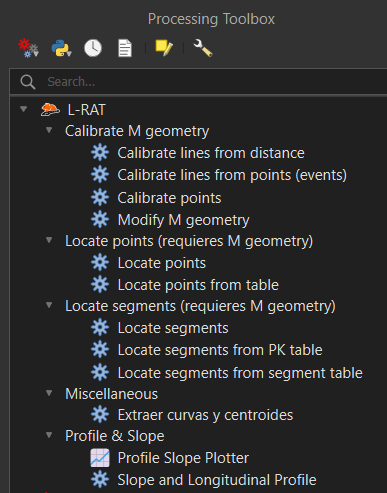
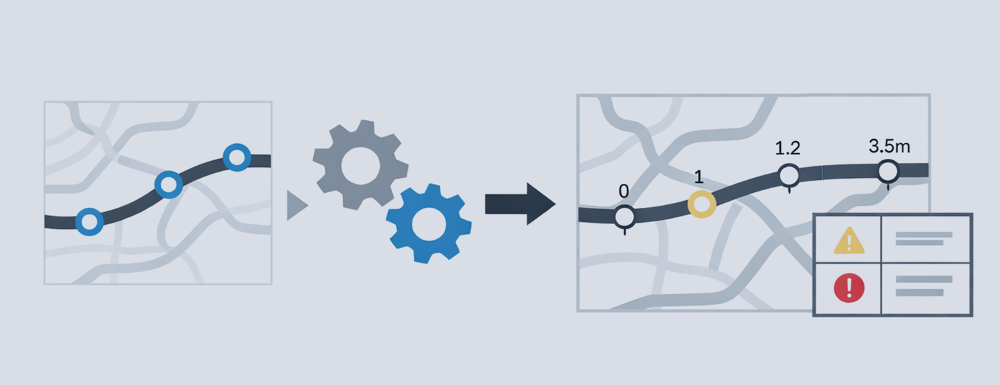
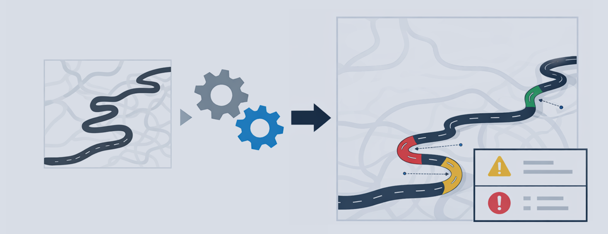
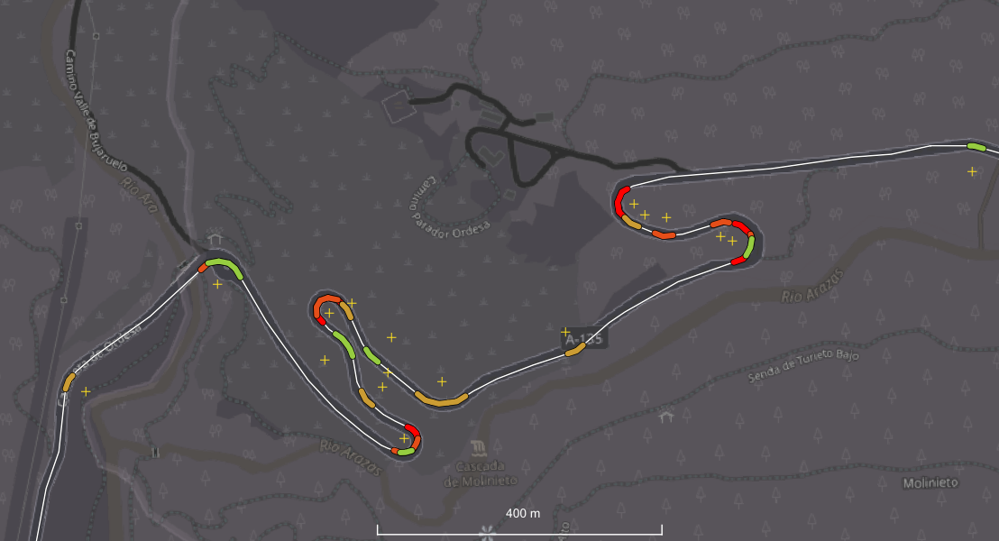
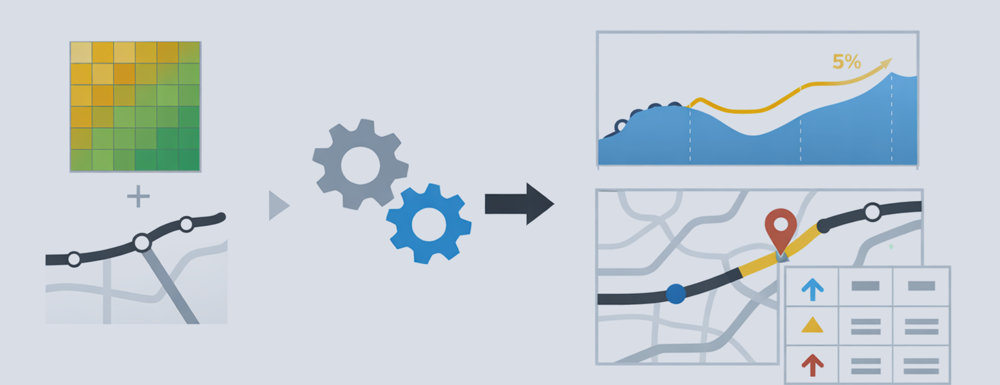
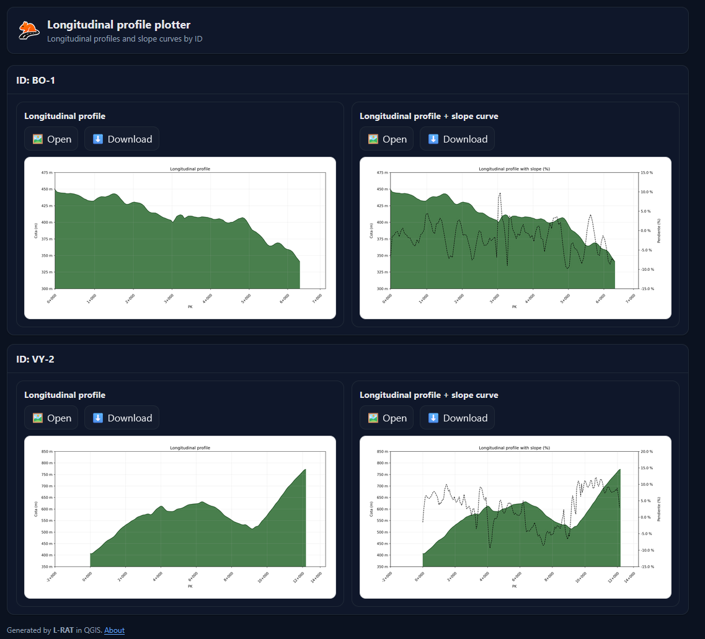
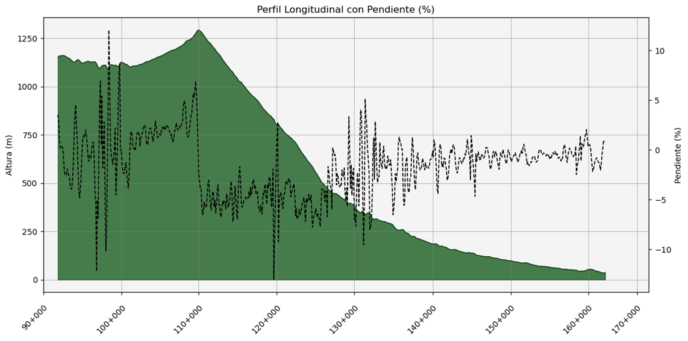

## L-RAT (Linear Referencing & Analysis Tools) — QGIS Processing Plugin
[See in English](README_EN.md)

L-RAT es un **plugin de Processing para QGIS** orientado a flujos de trabajo de **ingeniería viaria e infraestructuras lineales**. Incluye herramientas para:

- **Calibración (PK/M)**: añadir/derivar PK/M en geometrías (calcular PK de puntos por proximidad; generar/ajustar M en líneas).
- **Referenciación lineal (PK/M)**: localizar **puntos** y extraer **segmentos** sobre líneas calibradas (`LineStringM / MultiLineStringM`).
- **Perfiles y pendientes**: calcular perfil longitudinal y pendientes desde un eje y un DEM, y generar gráficos/salidas para cartografía. (no requiere PK/M)
- **Misc**: análisis geométrico sobre capas lineales (p. ej., detección de curvas y centros).

Repositorio: https://github.com/Javisionario/L-RAT

---

# Índice

- [1. Requisitos y conceptos](#1-requisitos-y-conceptos)
  - [1.1. Tipos de datos y geometrías soportadas](#11-tipos-de-datos-y-geometrías-soportadas)
  - [1.2. Qué es una geometría M](#12-qué-es-una-geometría-m)
  - [1.3. Unidades del campo M](#13-unidades-del-campo-m)
  - [1.4. Campo ROUTE_ID (Identificador de vía o ruta)](#14-campo-route_id-identificador-de-vía-o-ruta)
  - [1.5. Formatos de PK aceptados](#15-formatos-de-pk-aceptados)
  - [1.6. Gestión de incidencias](#16-gestion-de-incidencias)

- [2. Instalación](#2-instalación)
- [3. Estructura del plugin](#3-estructura-del-plugin)

- [4. Calibrate M geometry](#4-calibrate-m-geometry)
  - [4.1. Incidencias y trazabilidad](#41-incidencias-y-trazabilidad)
  - [4.2. Calibrate lines from distance](#42-calibrate-lines-from-distance)
  - [4.3. Calibrate lines from points/events](#43-calibrate-lines-from-pointsevents)
  - [4.4. Calibrate points](#44-calibrate-points)
  - [4.5. Edit calibration (Modify M values)](#45-edit-calibration-modify-m-values)

- [5. Locate points (requires M geometry)](#5-locate-points-requires-m-geometry)
  - [5.1. Incidencias y trazabilidad](#51-incidencias-y-trazabilidad)
  - [5.2. Ajustes por fuera de rango y por discontinuidades de cobertura (M)](#52-ajustes-por-fuera-de-rango-y-por-discontinuidades-de-cobertura-m)
  - [5.3. Locate points](#53-locate-points)
  - [5.4. Locate points from table](#54-locate-points-from-table)

- [6. Locate segments (requires M geometry)](#6-locate-segments-requires-m-geometry)
  - [6.1. Incidencias y trazabilidad](#61-incidencias-y-trazabilidad)
  - [6.2. Ajustes por fuera de rango y por discontinuidades de cobertura (M)](#62-ajustes-por-fuera-de-rango-y-por-discontinuidades-de-cobertura-m)
  - [6.3. Locate segments](#63-locate-segments)
  - [6.4. Locate segments from points/events (PK) table](#64-locate-segments-from-pointsevents-pk-table)
  - [6.5. Locate segments from segment table](#65-locate-segments-from-segment-table)

- [7. Miscellaneous](#7-miscellaneous)
  - [7.1. Curve Detection and Curvature Centers](#71-curve-detection-and-curvature-centers)

- [8. Profile & Slope](#8-profile--slope)
  - [8.1. Incidencias y trazabilidad](#81-incidencias-y-trazabilidad)
  - [8.2. Profile Slope Plotter](#82-profile-slope-plotter)
  - [8.3. Slope and Longitudinal Profile](#83-slope-and-longitudinal-profile)

- [9. Licencia](#9-licencia)
- [10. Autor](#10-autor)

---

# 1. Requisitos y conceptos

## 1.1. Tipos de datos y geometrías soportadas

**Geometrías lineales**
- `LineString` / `MultiLineString`
- `LineStringM` / `MultiLineStringM` (líneas con componente **M** por vértice)
- Opcionalmente `Z` (se conserva cuando aplica)

**Geometrías puntuales**
- `Point` / `MultiPoint` (eventos, hitos, muestras)

**Recomendación de CRS**
- Para medidas y distancias: **CRS proyectado** (metros).  

---

## 1.2. Qué es una geometría M

Las capas `LineStringM / MultiLineStringM` almacenan, además de X/Y (y opcionalmente Z), un valor **M** por vértice. En carreteras es habitual usar M como kilometraje/PK, lo que permite:
- **Interpolar** una posición en la línea a partir de un PK.
- **Extraer** tramos entre PK inicio y PK fin.
- **Calibrar** puntos por proximidad a una red con M.

**L-RAT** es una herramienta que permite realizar estas funciones.

---

## 1.3. Unidades del campo M

Los algoritmos de L-RAT incluyen parámetros de **unidades de M** (metros o kilómetros).  
Una configuración incorrecta produce resultados erróneos (p. ej., puntos desplazados o longitudes incoherentes).

---

## 1.4. Campo ROUTE_ID (Identificador de vía o ruta)

Muchos algoritmos trabajan por **ruta/vía** usando un identificador (típicamente `ROUTE_ID`):
- Una capa lineal (eje/viario) con `ROUTE_ID`.
- Una capa/tabla de eventos (puntos o segmentos) que referencia el mismo `ROUTE_ID`.

Si una vía está dividida en varios features, L-RAT puede:
- trabajar **por feature**, o
- **agrupar por ROUTE_ID** (cuando exista la opción), manteniendo coherencia global.

En redes densas o con vías paralelas, **restringir por ROUTE_ID** suele ser imprescindible para evitar emparejados erróneos.

---

## 1.5. Formatos de PK aceptados

L-RAT intenta ser flexible con la entrada de PK y acepta formatos habituales:
- `km+mmm` (ej.: `12+345`)
- número decimal en km (ej.: `12.345`, `3,05`)
- PK en **metros** (según algoritmo y opción de unidades)

---

## 1.6. Gestión de incidencias

L-RAT puede registrar incidencias para auditar ajustes, avisos y errores:
- en **campos de salida** (p.ej. `ADJUSTED`, `ADJUST_REASON`, `STATUS`),
- en una **tabla de incidencias** (opcional; se crea solo si se activa y hay incidencias),
- y en el **log** de Processing.

> NOTA: Los detalles (campos exactos y códigos) **se documentan por subgrupo** en 4.1 / 5.1 / 6.1, porque cambia ligeramente entre familias de algoritmos.

---

# 2. Instalación

- **Desde el repositorio oficial de plugins (recomendado)**: cuando esté publicado, instálalo desde **QGIS → Plugins → Administrar e instalar plugins** → All → Busca `L-RAT`.
- **Desde ZIP/GitHub** (desarrollo):
  1. Descarga el ZIP del repositorio.
  2. **QGIS → Plugins → Administrar e instalar plugins** → Instalar desde ZIP → selecciona el ZIP descargado.

---

# 3. Estructura del plugin

Los algoritmos aparecen en la **Caja de herramientas de Processing** bajo los siguientes subgrupos:

- **Calibrate M Geometry**
- **Locate points (requires M geometry)**
- **Locate segments (requires M geometry)**
- **Miscellaneous**
- **Profile & Slope**

---

# 4. Calibrate M geometry

Los algoritmos de este subgrupo constituyen una serie de herramientas para **calibrar** valores PK/M con el objetivo de preparar datos para flujos de referenciación lineal. Se trata de algoritmos para añadir o editar valores de calibración a geometrías existentes.

---

## 4.1. Incidencias y trazabilidad

En este subgrupo, la trazabilidad se apoya en **campos de control** en las salidas y, en algunos algoritmos, en una **tabla de incidencias** opcional.

**Mecanismos de trazabilidad (según algoritmo):**
- **Salida lineal con `STATUS` (string)**:  
  - *Calibrate lines from distance*  
  - *Calibrate lines from points (events)*  
  - *Modify M geometry*
- **Salida puntual con `INCIDENCE` (0/1) + `INC_TYPE` (string)**:
  - *Calibrate points*
- **Tabla de incidencias opcional (`OUTPUT_ISSUES`, sin geometría)** *(solo en algunos algoritmos)*:  
    - *Calibrate lines from points (events)*  
    - *Calibrate points*
  
  La tabla de incidencias **solo se crea si** el usuario activa la opción correspondiente, **y además** existen **filas reales** de incidencias.

**Comportamiento típico ante incidencias:**
- Los algoritmos lineales tienden a **devolver una salida por feature**. Cuando no se puede calibrar correctamente, `STATUS` describe el motivo y los campos de control pueden quedar a `NULL`.
- En *Calibrate points*, cada punto siempre sale en la capa final, pero:
  - `INCIDENCE = 1` indica incidencia,
  - `INC_TYPE` identifica el motivo,
  - algunos campos (`PK`, `M`, `DIST_AXIS`) pueden quedar a `NULL` según el caso.

---

## 4.2. Calibrate lines from distance

Calibra el valor **M** de una capa de líneas en función de la **distancia acumulada al origen**. El resultado es una capa `LineStringM` / `MultiLineStringM` (manteniendo Z si existe) calibrada según la distancia al origen (por feature o por ruta).

### Entradas
- **Capa de líneas**: Geometría a calibrar (con o sin M).

### Parámetros
- **Unidades de los valores de M (salida)**: `Meters (m)` / `Kilometers (km)`.
- **Valor inicial de M**: valor del punto de origen (en unidades de salida).
- **Invertir sentido**: M decrece en el sentido geométrico.
- **Sobrescribir M existente**: si está desactivado y la geometría ya tiene M, se marca como omitida en `STATUS`.
- (Avanzado) **Modo de cálculo de longitud**: `Auto`, `Planimétrico`, `Geodésico`.
  - `Auto`: (recomendado): usa distancias **planas** si el CRS es proyectado; si el CRS es geográfico, usa un **CRS local proyectado** para medir y localizar.
  - `Planimétrico`: fuerza distancias planas en el CRS de la capa.
  - `Geodésico`: fuerza el cálculo usando un CRS local proyectado.

### Salida
- **Líneas calibradas** (`LineStringM/MultiLineStringM`).
- Campos añadidos (además de los campos originales):
  - `M_START` (double)
  - `M_END` (double)
  - `LEN_M` (double) — longitud en unidades M (según configuración)
  - `STATUS` (string)
  - `N_SEGS` (integer) — número de segmentos del feature original (Recomendado revisar la continuidad de la calibración (valores M) en los casos `N_SEGS >1` en capas MultiLineString)

### Códigos de incidencias
`STATUS` puede tomar los siguientes valores:
- `OK`: calibrado correctamente.
- `SKIPPED_HAS_M`: no se recalibra porque ya tenía M y **Sobrescribir M existente** está desactivado.
- `BAD_GEOMETRY`: geometría vacía/no válida/no lineal.
- `ZERO_LENGTH`: longitud 0 (warning).
- `NO_REFERENCE_GEOM`: no se pudo construir/obtener una geometría de referencia válida para esa ruta (solo en modo por ruta).

<b>Nota:</b> Si la geometría de entrada es multipart (MultiLineString), cada parte se procesa por separado y la salida contendrá un feature por parte.

---

## 4.3. Calibrate lines from points/events

Calibra el campo **M** de una capa de líneas a partir de **eventos puntuales** (PK) almacenados en una capa de puntos.  
Cada punto se proyecta sobre la línea más cercana (o sobre la ruta correspondiente si se restringe por `ROUTE_ID`) y se utiliza como **punto de control** para interpolar y asignar M a lo largo del eje. El resultado es una capa LineStringM / MultiLineStringM calibrada según los PK proporcionados.

### Entradas
- **Capa de líneas**: Capa lineal a calibrar (con o sin valores M previos).
- **Capa de puntos de referencia (Eventos con PK)**: Puntos con valores de PK conocidos.
- **Campo PK en la capa de puntos**: Campo que contiene el valor del PK.

### Parámetros
- **Unidades del PK de entrada (campo de puntos)**:
  - `Auto ('PK+mmm' text or infer units: m / km)`
  - `Meters (m)`
  - `Kilometers (km)`
- **Unidades de los valores de M de salida**: `Meters (m)` / `Kilometers (km)`
- **Distancia de búsqueda/proyección máxima**  
  Umbral máximo para aceptar el emparejado punto–línea. Si el match más cercano queda más lejos, el punto se marca como incidencia (`TOO_FAR`) y no contribuye a la calibración. 
- **Tolerancia de ajuste (snap) en extremos (referencia por ruta)**  
  Tolerancia usada al construir la referencia por `ROUTE_ID` (cuando se agrupa por ruta).

### Opciones
- **Agrupar por ROUTE_ID**: (Requiere indicar el campo `ROUTE_ID` en puntos y líneas). Fuerza que los PK solo calibren su vía correspondiente. Además, el algoritmo detecta automáticamente forks y ejes paralelos y genera `warnings` si pueden afectar a la calibración.
- **Añadir ROUTE_ID a la salida (desde puntos)**: Si la salida ya tiene un campo `ROUTE_ID`, se crea `ROUTE_ID_FROM_PTS` para no sobreescribirlo.
- **Comportamiento fuera del rango de puntos de control**:
  - `Extrapolación lineal`: prolonga linealmente usando la pendiente de los controles extremos.
  - `Recortar al rango`: fija M al valor del control extremo más cercano (tramo constante y plano fuera de rango).
  - `Asignar NULL (NaN)`: deja M sin asignar fuera del rango (NULL/NaN), útil para identificar tramos sin calibración.

- *(Avanzado)* **Añadir multiplicador**: `M_final = M * factor`  
- *(Avanzado)* **Añadir desplazamiento**: `M_final = M + offset`
  
- *(Avanzado)* **Generar tabla de incidencias**: Se crea solo si se activa y existen incidencias.
- *(Avanzado)* **Generar puntos proyectados**: Permite comprobar la ubicación de los puntos proyectados frente a la capa de entrada.

> Nota forks/paralelos: el algoritmo detecta geometrías potencialmente ambiguas y emite *warnings* para revisión.

### Salidas
1) **Líneas calibradas** (`LineStringM / MultiLineStringM`)  
   Campos añadidos (además de los campos originales):
   - *(Opcional, si se activa “Añadir ROUTE_ID a la salida”)* `ROUTE_ID` **o** `ROUTE_ID_FROM_PTS` (string)
   - `N_CTRL` (int) — número de controles usados finalmente en ese feature (tras filtros)
   - `M_START` (double) — M en el primer vértice (puede ser `NULL` si hay NaN al inicio)
   - `M_END` (double) — M en el último vértice (puede ser `NULL` si hay NaN al final)
   - `M_LEN` (double) — `abs(M_END - M_START)` si ambos existen; si no, `NULL`
   - `LEN_GEOM` (double) — longitud geométrica de la línea (en unidades del CRS)
   - `LEN_ERR_M` (double) — `abs(LEN_GEOM - M_LEN_en_metros)` si existe `M_LEN`
   - `LEN_ERR_P` (double) — error porcentual respecto a `LEN_GEOM` si existe `M_LEN` y `LEN_GEOM>0`
   - `HAS_NULLM` (int) — 1 si algún vértice quedó con M = `NaN` (modo “Dejar NULL” fuera de rango)
   - `STATUS` (string)
   - `N_SEGS` (integer) — número de segmentos del feature original (Recomendado revisar la continuidad de la calibración (valores M) en los casos `N_SEGS >1` en capas MultiLineString)

> Nota: `LEN_GEOM` y, por tanto, `LEN_ERR_M`/`LEN_ERR_P` solo son interpretables en un CRS proyectado (metros). En CRS geográfico (grados) pueden ser valores no comparables.

2) **Puntos proyectados** *(opcional, si se activa)*  
   Campos:
   - `PT_ID` (string)
   - `LINE_FID` (int)
   - `ROUTE_ID_LINE` (string)
   - `ROUTE_ID_PTS` (string)
   - `PK_RAW` (string)
   - `M` (double)
   - `DIST_AXIS` (double)
   - `DIST_ALONG` (double)

3) **Incidencias (tabla)** *(opcional, si se activa y existen filas)*  
   Campos:
   - `INC_TYPE` (string)
   - `PT_ID` (string)
   - `ROUTE_ID` (string)
   - `PK_RAW` (string)
   - `LINE_FID` (int)
   - `DIST_AXIS` (double)
   - `DIST_ALONG` (double)
   - `NOTE` (string)

#### `STATUS` (salida lineal)
- `OK`: calibrado correctamente.
- `BAD_GEOMETRY`: geometría inválida o inconsistente durante el proceso.
- `NO_ROUTE_REFERENCE`: no se pudo construir referencia válida para esa ruta (en modo por `ROUTE_ID`).
- `INSUFFICIENT_POINTS`: no hay suficientes controles válidos para calibrar ese feature/ruta.

#### `INC_TYPE` (tabla de incidencias y/o warnings típicos)
- **Incidencias típicas ligadas a puntos (críticas para el punto):**
  - `BAD_GEOMETRY`: punto inválido/vacío/no puntual.
  - `PK_INVALID`: el PK no se pudo interpretar/convertir.
  - `NO_ROUTE`: falta `ROUTE_ID` en el punto o no existe en líneas (si se restringe por ruta).
  - `TOO_FAR`: existe línea candidata, pero la más cercana supera `Distancia máxima`.
  - `NO_MATCH`: no se pudo obtener un emparejado válido.
  - `INSUFFICIENT_POINTS`: no hay suficientes controles válidos para calibrar la ruta/feature.
  - `NO_ROUTE_REFERENCE`: no se pudo construir una referencia válida para la ruta (modo agrupar por `ROUTE_ID`).
- **Warnings/revisión de calidad:**
  - `DUPLICATE_POS_IGNORED`: varios PK proyectan en la misma posición sobre la referencia → se ignoran duplicados.
  - `NON_MONOTONIC_PK`: los PK no siguen el orden espacial a lo largo del eje (posible error de PK o de emparejado).
  - `ROUTE_TOPOLOGY_WARNING`: la referencia por ruta presenta señales de topología dudosa (discontinuidades/orden) y conviene revisar.

---

## 4.4. Calibrate points

Asigna a cada punto un **PK (km+mmm)** a partir del valor **M interpolado**, proyectando el punto sobre una capa lineal calibrada (`LineStringM / MultiLineStringM`). No modifica la geometría del punto: añade campos de calibración en atributos.

### Entradas
- **Capa de puntos a calibrar**
- **Capa de líneas calibrada (M)**

### Parámetros
- **Unidades del campo M**: m o km
- **Distancia de búsqueda/proyección máxima**: umbral para aceptar el emparejado (si el eje más cercano está más lejos, se marca incidencia)

### Opciones
- **Restringir emparejado por ROUTE_ID** (requiere `ROUTE_ID` en puntos y líneas)
  Solo busca coincidencias dentro de la misma ruta/vía. *(Recomendado si hay vías paralelas)*
- **Añadir ROUTE_ID a la salida (desde líneas)** (si ya existe, crea `ROUTE_ID_MATCH`)
  Copia el identificador de la línea emparejada al punto.
- **Generar tabla de incidencias (solo si existen)** *(avanzado)*

### Salidas
1) **Puntos calibrados** (atributos originales +)
- *(Opcional si se activa “Añadir ROUTE_ID a la salida (desde líneas)”)* `ROUTE_ID` **o** `ROUTE_ID_MATCH` (string)
- `PK` (string) — PK formateado `km+mmm`
- `M` (double)
- `DIST_AXIS` (double)
- `INCIDENCE` (int) — 0/1
- `INC_TYPE` (string)

2) **Incidencias (tabla)** *(opcional)*  
Campos: `PT_ID`, `ROUTE_ID`, `PK`, `M`, `DIST_AXIS`, `INC_TYPE`

### Códigos de `INC_TYPE`
- `BAD_GEOMETRY`: geometría vacía/no válida/no puntual.
- `NO_ROUTE`: falta `ROUTE_ID` o no existe en la capa de líneas (si se restringe por ruta).
- `NO_M_VALUES`: no se encuentran segmentos con valores M utilizables en las líneas candidatas.
- `TOO_FAR`: existe proyección con M, pero supera la distancia máxima.
- `NO_MATCH`: no se pudo obtener una proyección válida final.

---

## 4.5. Edit calibration (Modify M values)

Modifica los valores **M** existentes en una capa `LineStringM / MultiLineStringM` mediante operaciones típicas de recalibración.
No cambia `X`/`Y` (ni `Z`); solo reescribe **M**.

Está pensado para:
- Corregir errores de calibración
- Convertir unidades
- Invertir el sentido kilométrico
- Normalizar orígenes
- Limpiar pequeños “rebotes” en el campo M.

### Entradas
- **Capa de líneas con M** (`LineStringM / MultiLineStringM`)

### Operaciones
El algoritmo aplica las operaciones en el siguiente orden general:
**Factor/Desplazamiento → Invertir → Establecer M inicial → Recortar → Monotonía**.

- **Desplazamiento**: Desplaza todos los M una cantidad constante:`M' = M + offset`
- **Factor**: Escala todos los M. Útil para conversión de unidades o recalibración (ej.: km ↔ m):`M' = M * factor`
- **Invertir M (manteniendo rango)**: Invierte el sentido de M sin cambiar el rango: `M' = (Mmin + Mmax) − M`
- **Establecer M inicial (TARGET_START)**: Aplica un desplazamiento uniforme para que el primer vértice tenga el M indicado, manteniendo el resto consistente a partir de `TARGET_START`
- **Recortar (Clamp) al rango [min, max]**: Limita M a un intervalo mínimo/máximo, sirve para limpiar valores fuera de rango sin “remapear” la calibración (no comprime ni estira). Puede crear tramos planos al inicio o al final
- **Forzar monotonía**: corrige “rebotes” para que M sea siempre creciente o decreciente (con `epsilon`)

### Validación
- **Requerir M** (avanzado): Si se activa “Requerir M”, las geometrías sin M se marcan con `STATUS=NO_M_VALUES`. Si no se exige M, se omiten con `STATUS=SKIPPED_NO_M`.

### Ámbito (avanzado)
- **Por entidad/feature** (recomendado): Aplica operaciones usando el rango/origen de cada feature.
- **Por ROUTE_ID** (requiere `ROUTE_ID`): Usa un rango/origen común para varias features (útil si una ruta está partida).

### Salidas
- Capa con M modificado + `STATUS`
  - `OK`: modificado correctamente (o no hizo falta cambiar nada).
  - `SKIPPED_NO_M`: el feature no tiene M; se omite (si no se exige M).
  - `NO_M_VALUES`: no se han encontrado valores M utilizables para operar (incluye casos sin M).
  - `BAD_GEOMETRY`: geometría inválida/no lineal.
  - `NO_ROUTE`: falta `ROUTE_ID` válido (si el ámbito es por ruta).

---

# 5. Locate points (requires M geometry)

Los algoritmos de este subgrupo localizan (interpolan) puntos sobre una red/eje **calibrado con geometría M** con valores válidos (`LineStringM / MultiLineStringM`) a partir de `ROUTE_ID + PK`.

### Parámetros comunes

- **Capa lineal calibrada** (`LineStringM / MultiLineStringM`): red/eje con valores M.
- **Campo ROUTE_ID**: campo `ROUTE_ID` (string) sobre el que se indexan rutas.
- **Unidades de los valores de M** (km o m)

**Opciones avanzadas (comunes):**
- **Tolerancia (km)**: corrige pequeños desajustes dentro de tramo calibrado (redondeos o calibración imperfecta). **No corrige discontinuidades de cobertura**: solo ayuda si el PK cae muy cerca de un valor existente/interpolable.
- **Ajustar al PK disponible más cercano**: controla qué ocurre cuando el PK cae en una **discontinuidad** (por geometría incompleta o cobertura de M):
  - Activado → el punto puede generarse ajustando el PK al valor **cubierto** más cercano (`ADJUST_REASON=GAP_SNAP`).
  - Desactivado → el evento pasa a **crítico** (`NO_MATCH`) y no se crea el punto.
- **Generar tabla de incidencias (ajustes/críticos)**  
  Si está activada, genera la tabla **solo si** existen filas reales de incidencias (ajustes o críticos).

---

## 5.1. Incidencias y trazabilidad

La trazabilidad en este subgrupo se basa en:
- Campos de control en la salida de puntos: `PK_REQ`, `PK`, `ADJUSTED`, `ADJUST_REASON`, `STATUS`.
- Una tabla opcional **Incidencias (tabla)** con campos: `ADJUSTED`, `ADJUST_REASON`, `WARNINGS`, `CRITICALS`.

### Salida puntual (campos de control)
- `PK_REQ`: PK solicitado (formateado `km+mmm`).
- `PK`: PK finalmente utilizado (puede ser ajustado).
- `ADJUSTED`: `0/1`.
- `ADJUST_REASON`: motivos separados por `;` (p.ej. `OUT_OF_RANGE;GAP_SNAP`).
- `STATUS`: para puntos generados, el algoritmo escribe `OK`.

### Tabla de incidencias (opcional)
- Solo se crea si está activada la opción **y** hay filas reales (ajustes y/o críticos).
- Registra:
  - **Ajustes**: fila con `ADJUSTED=1`, `ADJUST_REASON=...`, `CRITICALS` vacío.
  - **Críticos**: fila con `CRITICALS` (p.ej. `NO_ROUTE`, `PK_INVALID`, `NO_M_RANGE`, `NO_MATCH`).

### Códigos de ajustes (ADJUST_REASON)
- `OUT_OF_RANGE`  
  El PK solicitado está fuera del rango global `[M_min, M_max]` de la ruta y se recorta al extremo más cercano.
- `GAP_SNAP`  
  El PK cae en una **discontinuidad de cobertura de M** y, si está activado el ajuste, se “snappea” al PK **cubierto** más cercano.

### Códigos de errores críticos (CRITICALS)
- `NO_ROUTE`: el `ROUTE_ID` no existe en la capa lineal o no se pudo indexar.
- `NO_M_RANGE`: no se pudo obtener un rango M válido para esa ruta.
- `NO_MATCH`: no se pudo interpolar el punto (incluye discontinuidad con snap desactivado).

> Nota sobre `PK_INVALID`:
> - En **Locate points from table**, `PK_INVALID` puede aparecer como crítico **por fila** (PK no interpretable).
> - En **Locate points (manual)**, un PK inválido en la entrada provoca un **error de validación** y el algoritmo se detiene (no se reporta como crítico por evento).

---

## 5.2. Ajustes por fuera de rango y por discontinuidades de cobertura (M)

En redes por tramos (varios features por `ROUTE_ID`, o calibración no continua) pueden existir **discontinuidades** (zonas no cubiertas para ciertos valores de PK), tanto por geometrías divididas como por la propia calibración de M en la geometría.

L-RAT distingue dos situaciones:

### 1) Fuera de rango global (`OUT_OF_RANGE`)
El PK solicitado está fuera del rango global disponible para esa ruta (`M_min–M_max`, considerando todas las geometrías del `ROUTE_ID`).  
El algoritmo recorta el PK al extremo más cercano y marca:
- `ADJUSTED=1`
- `ADJUST_REASON` incluye `OUT_OF_RANGE`

### 2) Discontinuidad de cobertura (de M) (`GAP_SNAP`)
El PK está dentro del rango global, pero **ningún tramo** de esa ruta lo cubre (no es interpolable en ningún `LineStringM` disponible).  
Si está activada la opción **Ajustar al PK disponible más cercano**, el algoritmo:
- busca el **PK cubierto más cercano**,
- ajusta el PK a ese valor,
- marca `ADJUST_REASON` con `GAP_SNAP`.

Si esa opción está desactivada y el PK cae en una discontinuidad:
- el evento se marca como **crítico** `NO_MATCH` y **no se crea** el punto.

> Un mismo evento puede acumular ambos motivos: por ejemplo, un PK fuera de rango se recorta al extremo (`OUT_OF_RANGE`) y, si ese extremo no está cubierto por ningún tramo, puede aplicarse además `GAP_SNAP`.

---

## 5.3. Locate points

Localiza (interpola) **1 o 2 puntos** sobre una capa lineal calibrada a partir de `ROUTE_ID + PK` introducidos manualmente.

### Entradas
- **Capa de líneas calibrada (M)** + **campo ROUTE_ID**.
- **Unidades de los valores de M**.
- **Punto 1 (obligatorio)**:
  - `Route id (punto 1)`
  - `PK (punto 1)`
  - `ID adicional (punto 1)` *(opcional)*
- **Punto 2 (opcional)**:
  - `Definir punto 2` (switch)
  - `Route id (punto 2)`
  - `PK (punto 2)`
  - `ID adicional (punto 2)` *(opcional)*
 
> Formato de PK: `km+mmm` o decimal km (e.j., `12+345`, `12.345`, `3,05`).

### Salidas
1) **Puntos localizados** (capa de puntos)
- `ROUTE_ID` (string)
- `EVENT_ID` (string) *(solo si se ha proporcionado algún ID opcional en punto 1 o 2)*
- `PK_REQ` (string): PK solicitado
- `PK` (string): PK ubicado
- `ADJUSTED` (int)
- `ADJUST_REASON` (string)
- `STATUS` (string) → `OK` en puntos generados

2) **Incidencias (tabla)** *(opcional; solo si hay filas)*
- `ROUTE_ID`
- `EVENT_ID` *(solo si existe en la salida)*
- `PK_REQ`
- `ADJUSTED`, `ADJUST_REASON`
- `WARNINGS`, `CRITICALS`

> Para el significado de `ADJUST_REASON`, `WARNINGS` y `CRITICALS`, ver [5.1. Incidencias y trazabilidad](#51-incidencias-y-trazabilidad).

---

## 5.4. Locate points from table

Localiza puntos usando una tabla/capa de eventos: cada fila define un punto mediante `ROUTE_ID + PK` (y opcionalmente un ID).

### Entradas
- **Capa de líneas calibrada (M)** + campo `ROUTE_ID`.
- **Tabla de eventos/puntos** con:
  - `Campo ROUTE_ID en la tabla`
  - `Campo PK en la tabla`
  - `Campo de ID adicional` *(opcional)*

> Formato de PK: `km+mmm` o decimal km (e.j., `12+345`, `12.345`, `3,05`).

### Opciones específicas
- **Añadir campos de la tabla a la salida**  
  Si está activado, copia todos los campos de la tabla a la salida.  
  Si hay colisión de nombres, se añade sufijo `_TBL` al campo copiado.

### Salidas
1) **Puntos localizados** (capa de puntos)
- `ROUTE_ID` (string)
- `PK_ID` (string) *(solo si se configuró “Campo de ID adicional”)*
- `PK_REQ`, `PK`, `ADJUSTED`, `ADJUST_REASON`, `STATUS`
- *(Opcional)* campos de la tabla (si se activó “Añadir campos…”; con `_TBL` si hay colisión)

2) **Incidencias (tabla)** *(opcional; solo si hay filas)*
- `ROUTE_ID`
- `PK_ID` *(solo si se configuró ID de evento)*
- `PK_REQ`
- `ADJUSTED`, `ADJUST_REASON`
- `WARNINGS`, `CRITICALS`

> Para el significado de `ADJUST_REASON`, `WARNINGS` y `CRITICALS`, ver [5.1. Incidencias y trazabilidad](#51-incidencias-y-trazabilidad).

---

# 6. Locate segments (requires M geometry)

Los algoritmos de este subgrupo extraen **segmentos** (líneas) definidos por `ROUTE_ID + PK_INI + PK_FIN` sobre una red/eje **calibrado con geometría M** con valores válidos (`LineStringM / MultiLineStringM`).

### Parámetros comunes

- **Capa de líneas calibrada (M)** (`LineStringM / MultiLineStringM`) y su **campo ROUTE_ID** en base al que se identifica la vía a extraer.
- **Unidades de los valores de M**: `Meters (m)` / `Kilometers (km)`.
- **Generar puntos de extremos** *(opcional)*: crea 2 puntos por segmento (inicio/fin) con `PK_REQ` (solicitado) y `PK` finalmente usado.

**Opciones avanzadas (comunes):**
- **Tolerancia (km) para encaje por M (snap/rounding)**: ayuda a resolver pequeños desajustes dentro de un tramo calibrado (**no corrige discontinuidades de cobertura**).
- **Ajustar al PK disponible más cercano**: controla qué ocurre cuando el PK cae en una **discontinuidad** (por geometría incompleta o cobertura de M):
  - Activado → el extremo puede ajustarse al PK más cercano (`ADJUST_REASON=GAP_SNAP`).
  - Desactivado → el evento pasa a **crítico** (`NO_MATCH`) y no se genera geometría.
- **Generar tabla de incidencias si hubiera (ajustes/warnings/críticos)**: si está activada, registra incidencias por evento/grupo en caso de que las haya (según algoritmo).

---

## 6.1. Incidencias y trazabilidad

La trazabilidad en este subgrupo se apoya en:
- **Campos de control** en la salida de segmentos.
- **Puntos extremos (opcional)** con campos por extremo.
- **Tabla opcional “Incidencias (tabla)”** (sin geometría) con campos `WARNINGS` y `CRITICALS` (y, según algoritmo, campos identificativos).

### Campos de control (salida de segmentos)
- `PK_INI` / `PK_FIN` (string): PK usados finalmente para extraer el segmento (formato `km+mmm`).
- `DIST_PK_KM` (double): distancia en km entre `PK_INI` y `PK_FIN`.
- `DIST_GEOM_KM` (double): longitud geométrica del/los segmento(s) extraído(s), en km.
- `ADJUSTED` (int): `0/1`. Indica si se ha aplicado algún ajuste.
- `ADJUST_REASON` (string): motivos separados por `;` (p.ej. `OUT_OF_RANGE;GAP_SNAP`).
- `N_PIECES` (int): número de piezas generadas. Si `N_PIECES > 1`, se registra el warning `SEGMENT_SPLIT`.
- `STATUS` (string): estado del segmento generado (en la práctica `OK` para segmentos creados; los eventos críticos **no generan geometría**).

### Puntos extremos (opcional)
Crea 2 puntos por segmento:
- `PK_REQ` (string): PK solicitado para ese extremo.
- `PK` (string): PK finalmente usado tras ajustes.
- `ADJUSTED` (int), `ADJUST_REASON` (string).
- Más campos identificativos (según algoritmo): `SEG_ID`, `PAIR_ID` o `EVENT_ID`, además de `ROUTE_ID`.

### Tabla “Incidencias (tabla)” (opcional)
- Se crea **solo si** el usuario activa la opción y existen filas reales.
- Para cada evento/grupo (según algoritmo), registra:
  - `ADJUSTED` / `ADJUST_REASON` (si hubo ajustes),
  - `WARNINGS` (lista codificada en string),
  - `CRITICALS` (lista codificada en string).
- **Si el evento es crítico**: no hay geometría de salida, pero se registra una fila en esta tabla.

### Códigos de ajustes, warnings y críticos

**Ajustes (`ADJUST_REASON`)**
- `OUT_OF_RANGE`: Un extremo está fuera del rango global disponible para ese `ROUTE_ID` (`M_min–M_max`, considerando todos los tramos) y se recorta al extremo más cercano.
- `GAP_SNAP`: El PK está dentro del rango global, pero cae en una **discontinuidad de cobertura M** (no interpolable en ningún tramo disponible).  
  Si está activada la opción de ajuste, se usa el PK cubierto más cercano.

**Warnings (`WARNINGS`)**
- `SEGMENT_SPLIT`: El segmento se ha generado en varias piezas (`N_PIECES > 1`).
- `ODD_PK_IGNORED` *(solo en* **Locate segments from PK table***)*: En un `(ROUTE_ID, PAIR_ID)` queda un PK suelto sin pareja y se ignora.

**Críticos (`CRITICALS`) — no se genera el segmento**
- `NO_ROUTE`: El `ROUTE_ID` solicitado no existe (o es vacío/nulo) respecto a la capa lineal indexada.
- `PK_INVALID`: Algún PK no es interpretable/convertible (por ejemplo, texto no parseable como `km+mmm` o km decimal).
- `NO_M_RANGE`: No se pudo obtener un rango M válido para esa ruta (considerando todos los tramos del `ROUTE_ID`).
- `NO_MATCH`: No se pudo extraer geometría para el tramo solicitado **aunque el `ROUTE_ID` exista**, típicamente por:
  - extremos en discontinuidad con `GAP_SNAP` desactivado,
  - tramo no cubierto por ningún `LineStringM` disponible para ese `ROUTE_ID`,
  - extracción vacía tras aplicar (o no poder aplicar) los ajustes.

> Un mismo evento puede acumular varios motivos (por ejemplo `OUT_OF_RANGE;GAP_SNAP`) si tras recortar al extremo global, ese extremo no está cubierto por ningún tramo.

---

## 6.2. Ajustes por fuera de rango y por discontinuidades de cobertura (M)

En redes por tramos (varios features por `ROUTE_ID`, o calibración no continua) pueden existir **zonas no cubiertas** para ciertos valores de PK. L-RAT distingue:

### 1) Fuera de rango global (`OUT_OF_RANGE`)
El PK solicitado está fuera del rango global disponible para esa ruta (`M_min–M_max`, considerando todas las geometrías del `ROUTE_ID`).  
El algoritmo recorta el PK al extremo más cercano y marca:
- `ADJUSTED=1`
- `ADJUST_REASON` incluye `OUT_OF_RANGE`

### 2) Discontinuidad de cobertura M (`GAP_SNAP`)
El PK está dentro del rango global, pero **ningún tramo** de esa ruta lo cubre (no es interpolable en ningún `LineStringM` disponible).  
Si está activada la opción **Ajustar al PK disponible más cercano…**, el algoritmo:
- busca el **PK cubierto** más cercano,
- ajusta el extremo a ese valor,
- marca `ADJUST_REASON` con `GAP_SNAP`.

Si esa opción está desactivada y un extremo cae en una discontinuidad:
- el evento se marca como **crítico** `NO_MATCH` y **no se genera** el segmento.

---

## 6.3. Locate segments
Extrae **1 o 2 segmentos** sobre una capa lineal calibrada a partir de `ROUTE_ID + PK_INI + PK_FIN` introducidos manualmente.

### Entradas
- **Capa de líneas calibrada (M)**
- **Campo identificador de vía (route id)**
- **Unidades del campo M**
- **Segmento 1 (obligatorio)**:
  - `Identificador de vía (segmento 1)`
  - `PK inicio (segmento 1)`
  - `PK fin (segmento 1)`
  - `ID adicional de segmento (segmento 1)` *(opcional)* (SEG_ID)
- **Segmento 2 (opcional)**:
  - `Definir segundo segmento`
  - `Identificador de vía (segmento 2)`
  - `PK inicio (segmento 2)`
  - `PK fin (segmento 2)`
  - `ID adicional de segmento (segmento 2)` *(opcional)* (SEG_ID)

> Formato de PK: `km+mmm` o número decimal en km (ej.: `12+345`, `12.345`, `3,05`).

### Opciones específicas
- **Generar puntos de extremos (opcional)**: crea 2 puntos por segmento (inicio/fin) con `PK_REQ` vs `PK`.

### Salidas
1) **Segmentos extraídos (líneas)**  
Campos típicos:
- `ROUTE_ID` (string)
- `SEG_ID` (string) *(solo si se proporcionó ID opcional en segmento 1/2)*
- `PK_INI`, `PK_FIN`, `DIST_PK_KM`, `DIST_GEOM_KM`, `ADJUSTED`, `ADJUST_REASON`, `N_PIECES`, `STATUS`

2) **Puntos extremos (opcional)**  
2 puntos por segmento con: `ROUTE_ID`, `PK_REQ`, `PK`, `ADJUSTED`, `ADJUST_REASON` (+ `SEG_ID` si existe).

3) **Incidencias (tabla)** *(opcional; solo si hay filas)*  
Incluye `WARNINGS` y `CRITICALS` (ver [6.1](#61-incidencias-y-trazabilidad)).
 
---

## 6.4. Locate segments from points/events (PK) table

Genera segmentos desde una tabla donde **cada fila aporta un PK**, asociado a `ROUTE_ID` y `PAIR_ID`. Identifica los segmentos mediante la relación de pares de PKs con dicho identificador que idealmente ha de ser único para cada segmento para un correcto funcionamiento del algoritmo.

#### Cómo funciona (emparejado)
Para cada `(ROUTE_ID, PAIR_ID)`:
- Ordena los PK numéricamente.
- Empareja secuencialmente: (0–1), (2–3), (4–5)...
- Si queda un PK suelto, se ignora y se registra el warning `ODD_PK_IGNORED`

### Entradas
- **Capa de líneas calibrada (M)** y su campo `ROUTE_ID`.
- **Tabla de PKs (cada fila = 1 PK)**.
  - `Campo ROUTE_ID en la tabla`: Permite identificar la vía en donde esta el segmento
  - `Campo PAIR_ID (segmento/evento) en la tabla`: Identificador de puntos que definen cada segmento.
  - `Campo PK en la tabla`
- **Unidades del campo M**

> Formato de PK: `km+mmm` o número decimal en km (ej.: `12+345`, `12.345`, `3,05`).

### Opciones específicas
- **Añadir campos de la tabla a la salida**: copia campos de la tabla al segmento resultante. Si hay colisión con campos propios de salida, se añade prefijo `T_` (p.ej. `T_MI_CAMPO`).
- **Generar puntos de extremos (opcional)**

### Salidas
1) **Segmentos extraídos (líneas)**  
Campos típicos:
- `ROUTE_ID`, `PAIR_ID`
- `PK_INI`, `PK_FIN`, `DIST_PK_KM`, `DIST_GEOM_KM`
- `ADJUSTED`, `ADJUST_REASON`, `N_PIECES`, `STATUS`
- *(Opcional)* campos copiados desde la tabla (con `T_` si colisionan).

2) **Puntos extremos (opcional)**  
2 puntos por segmento con: `ROUTE_ID`, `PAIR_ID`, `PK_REQ`, `PK`, `ADJUSTED`, `ADJUST_REASON`.

3) **Incidencias (tabla)** *(opcional; solo si hay filas)*  
Incluye `WARNINGS` (p.ej. `SEGMENT_SPLIT`, `ODD_PK_IGNORED`) y `CRITICALS` (ver [6.1](#61-incidencias-y-trazabilidad)).

---

## 6.5. Locate segments from segment table

Extrae segmentos desde una tabla de segmentos donde **cada fila define un tramo** a partir de `ROUTE_ID + PK_INI + PK_FIN` y (opcionalmente) un `EVENT_ID`.

### Entradas
- **Capa de líneas calibrada (M)** y su campo `ROUTE_ID`.
- **Tabla de segmentos (cada fila = 1 segmento)** con:
  - `Campo ROUTE_ID en la tabla`: Permite identificar la vía en donde esta el segmento
  - `Campo PK inicio`
  - `Campo PK fin`
  - `Campo ID de evento/segmento` *(opcional)*
- **Unidades del campo M**

> Formato de PK: `km+mmm` o número decimal en km (ej.: `12+345`, `12.345`, `3,05`).

### Opciones específicas
- **Añadir campos de la tabla a la salida**: copia campos de la tabla al segmento resultante.  
  Si hay colisión con campos propios de salida, se añade prefijo `T_`.
- **Generar puntos de extremos (opcional)**.

### Salidas
1) **Segmentos extraídos (líneas)**  
Campos típicos:
- `ROUTE_ID`
- `EVENT_ID` *(solo si se configuró un campo ID en la tabla)*
- `PK_INI`, `PK_FIN`, `DIST_PK_KM`, `DIST_GEOM_KM`
- `ADJUSTED`, `ADJUST_REASON`, `N_PIECES`, `STATUS`
- *(Opcional)* campos copiados desde la tabla (con `T_` si colisionan).

2) **Puntos extremos (opcional)**  
2 puntos por segmento con: `ROUTE_ID`, `PK_REQ`, `PK`, `ADJUSTED`, `ADJUST_REASON` (+ `EVENT_ID` si existe).

3) **Incidencias (tabla)** *(opcional; solo si hay filas)*  
Incluye `WARNINGS` (p.ej. `SEGMENT_SPLIT`) y `CRITICALS` (ver [6.1](#61-incidencias-y-trazabilidad)).

---
# 7. Miscellaneous

## 7.1. Curve Detection and Curvature Centers

Detecta **segmentos locales de curvatura** en una capa lineal, estima su **radio de curvatura** y opcionalmente, calcula **centros de curvatura** (circuncentros) y los agrupa por proximidad para generar una capa de centros agrupados.

> NOTA : la capa de “curvas” no contiene tramos agregados/continuos; cada entidad corresponde a una detección local basada en una tripleta consecutiva `p1–p2–p3` (pueden solaparse entre sí).

### Entradas
- **Capa de líneas de entrada**: capa vectorial de líneas a analizar.

### Parámetros
- **Intervalo de densificación** *(Distance; unidades del CRS)*  
  Distancia entre vértices añadidos al densificar la geometría. *(Por defecto: 15.0)*
- **Radio mínimo** *(Distance; unidades del CRS)*: descarta detecciones con radio demasiado pequeño (curvas muy cerradas o ruido de la geometría). *(Por defecto: 2.0)*
- **Radio máximo** *(Distance; unidades del CRS)*: Filtra detecciones con radio demasiado grande (curvas muy planas asimilables a rectas). *(Por defecto: 50.0)*
- **Distancia mínima entre vértices** *(Distance; unidades del CRS)*: Evita cálculos inestables ignorando tripletas donde `dist(p1,p2)` o `dist(p2,p3)` sea muy pequeña. *(Por defecto: 0.5)*
- **Generar capa de centros de curva** *(bool)*: Si se activa, calcula centros de curvatura y genera la capa de centroides agrupados. *(Por defecto: False)*
- **Distancia de agrupación de centros** *(Distance; unidades del CRS)*: Distancia máxima para agrupar centros en el mismo cluster. *(Por defecto: 10.0)*  
  > Solo aplica si está activado “Generar capa de centros de curva”.
**Validaciones (si fallan, el algoritmo no se ejecuta):**
- Intervalo de densificación > 0
- Radio mínimo < Radio máximo
- Distancias (mínima entre vértices / agrupación) ≥ 0

> Ver [Limitaciones y recomendaciones](#limitaciones-y-recomendaciones)

### Salidas

1) **Capa de segmentos de curva** (líneas)  
Cada entidad representa una detección local (tripleta `p1–p2–p3`), con atributos:
- `ID_Curva` (int): identificador incremental (0..n-1).
- `ID_Centroide` (int): id del cluster asociado, o `-1` si no aplica / no se generaron centros.
- `Radio` (double): radio estimado (en unidades del CRS).
- `Longitud` (double): longitud de la polilínea `p1–p2–p3` (en unidades del CRS).

2) **Capa de centroides (agrupados)** *(opcional, puntos)*  
Solo se genera si se activa “Generar capa de centros de curva”.
Cada entidad representa un cluster de centros:
- `ID_Centroide` (int): identificador del cluster.
- `Radio_medio` (double): radio medio de las curvas asignadas al cluster.
- `Conteo` (int): número de curvas en el cluster.

### Metodología (resumen técnico)

1) **Densificación**  
Se densifica cada geometría con el intervalo indicado para obtener vértices más regulares.

2) **Estimación de radio por tripletas**  
Para cada tripleta consecutiva `(p1, p2, p3)`:
- Calcula distancias `a=dist(p1,p2)`, `b=dist(p2,p3)`, `c=dist(p3,p1)`.
- Calcula semiperímetro `s=(a+b+c)/2`.
- Calcula el área con Herón: `area = sqrt(s(s−a)(s−b)(s−c))`.
- Estima el radio del circuncírculo: `R = (a·b·c)/(4·area)`.
- Si los puntos son casi colineales (área ~ 0), se omite la tripleta.
- Se acepta la detección solo si **`Radio mínimo < R < Radio máximo`** (filtros estrictos).

3) **Centros de curvatura y agrupación (opcional)**  
- Calcula el centro del circuncírculo para cada tripleta válida.
- Agrupa centros por proximidad usando la “Distancia de agrupación de centros”.
- El centroide del cluster se actualiza como la media de los centros asignados.

### Limitaciones y recomendaciones

- **Usa un CRS proyectado en metros** (UTM o similar).  
  El algoritmo usa longitudes/distancias planas del CRS; en CRS geográfico (lat/long) los valores serán incorrectos.
- **Intervalo de densificación**: es el parámetro más sensible.
  - demasiado grande → puedes perder curvas (pocos vértices)
  - demasiado pequeño → sube el coste y puede generar exceso de detecciones (y “ruido”)
- Si la geometría tiene **ruido** o exceso de vértices, puede producir detecciones falsas.
- Si la capa de centroides sale vacía:
    - revisa `Radio mínimo/máximo`, `Distancia mínima entre vértices` y `Distancia de agrupación de centros`
- **Para reducir ruido / exceso de detecciones**:
  - sube ligeramente el **Intervalo de densificación** (menos sensibilidad),
  - aumenta **Radio mínimo** (descarta curvas muy cerradas/noise),
  - baja **Radio máximo** (descarta casi-rectas),
  - aumenta **Distancia mínima entre vértices** (evita tripletas degeneradas).

- **Para no perder curvas**:
  - baja el **Intervalo de densificación** (más detalle),
  - revisa que `Radio mínimo` no sea demasiado alto,
  - y que `Radio máximo` no sea demasiado bajo.

---

# 8. Profile & Slope

Este subgrupo reúne dos algoritmos para **calcular perfiles longitudinales y pendientes (%)** a partir de un **DEM** (raster local o WCS) y, posteriormente, **graficar** esos resultados de forma automática.

---

## 8.1. Incidencias y trazabilidad

En este subgrupo la trazabilidad se apoya en:
- **Campos de calidad en las salidas** (`SLOPE_TYPE` en la tabla y en la capa segmentada). 
- **Warnings en el log de Processing** (por ejemplo, campos opcionales inexistentes) y **errores** cuando no es posible producir resultados (p. ej. no hay datos válidos para graficar). 

#### `SLOPE_TYPE` (calidad de la pendiente)
Tanto en la **tabla** como en la **capa segmentada**, el campo `SLOPE_TYPE` indica el origen/calidad del valor de pendiente: 
- `REAL`: pendiente calculada con datos de cota válidos en ambos extremos del tramo.
- `INTERP`: pendiente rellenada por **interpolación** entre tramos vecinos con pendiente real.
- `EXTRAP`: pendiente rellenada por **extrapolación** (se mantiene el valor válido más cercano).
- `NODATA`: no hay información suficiente (pendiente no disponible).

> Nota: el algoritmo rellena pendientes faltantes para mantener una **capa segmentada continua**, pero deja trazabilidad con `SLOPE_TYPE`.
---

## 8.2. Profile Slope Plotter

Genera gráficos **PNG** y un informe **HTML (index)** a partir de una tabla/dataset con:
- distancia desde el origen (**metros**),
- cota (perfil),
- y opcionalmente pendiente (%).

Está diseñado para graficar la tabla generada por **Slope and Longitudinal Profile**, aunque puede usarse con cualquier tabla compatible.

### Entradas
- **Tabla/capa de entrada (puede ser sin geometría)**.

### Parámetros
- **Campo ID (un gráfico por ID)** *(opcional; por defecto `ID_Segmento`)*: Si existe, genera un conjunto de gráficos por cada ID. Si el campo no existe, se registra warning y se trata todo como un único grupo (`ALL`). 
- **Campo X (distancia desde origen, en metros)** *(por defecto `Dist_Origen_metros`)*
- **Campo Y (elevación / perfil)** *(por defecto `Cota_SUAV`)*
- **Campo pendiente (%)** *(opcional; por defecto `SLOPE`)*: Si el campo no existe, se registra warning y la pendiente se considera `NaN`.
- **Usar PK en el eje X (si existe)** *(bool)*: Cambia el **etiquetado** del eje X a PK (`K+MMM`) usando el campo PK (km). Si se activa pero el campo no existe, se registra warning y se desactiva el modo PK.
- **Campo PK (km, ej. 91.740)** *(opcional; por defecto `m_field_PK_KM`)*
- **Mostrar etiquetas de ejes** (*bool*): Activado: muestra títulos y nombres de ejes. Desactivado: no se muestra letreros, lo que favorece el uso del gráfico en otros idiomas.

### Cómo funciona el eje X (distancia vs PK)
- El perfil **siempre se representa contra la distancia real** (`X_FIELD`, en metros).
- Si se activa **Usar PK**, el algoritmo **usa PK para construir las marcas/etiquetas del eje X**:

### Cómo funciona el eje Y (cota)
- El eje de cota no comienza necesariamente en 0, ajusta automáticamente sus límites al rango a representar.

### Salidas
Check `Processing Toolbox` → `Results Viewer`
- **Carpeta** con PNG por cada ID:
  - `perfil_<ID>.png`
  - `perfil_pendiente_<ID>.png`
- **Informe HTML (index)** con vista previa y enlaces.

---

## 8.3. Slope and Longitudinal Profile

A partir de una línea (eje) y un DEM, genera:
- una **tabla** de perfil longitudinal (distancia acumulada vs cota) + pendientes (%),
- y una **capa segmentada** (micro-tramos) para facilitar su representación cartográfica.

### Entradas
- **Capa de líneas de entrada** (eje o ejes a analizar).
- **DEM (raster local o WCS)**.

### Parámetros (básicos)
- **Campo ID del segmento (opcional)**: si se indica, se conserva como `ID_Segmento` en salidas.
- **Intervalo de muestreo (m). 0 = resolución del raster** *(por defecto 0)*: si `=0`, el algoritmo calcula un paso automático a partir del **tamaño de píxel** del DEM (convertido a metros).
- **Invertir sentido del perfil**: cambia el origen (inicio ↔ fin).

### Opciones avanzadas
- **Método de muestreo del DEM**:
  - `Nearest`: toma el valor del píxel más cercano. Método rápido que conserva los valores originales si bien puede ofrecer un resultado escalonado.
  - `Bilineal`: interpola usando 4 píxeles vecinos, ofreciendo un resultado suave y estable.
  - `Cubico` *(por defecto `Cubic` con fallback a bilinear si falla)*: interpola usando un vecindario mayor (más suave, más lento).

- **Suavizado del perfil** *(por defecto `Savitzky–Golay`)*:
  - `Ninguno`
  - `Media móvil`: Sustituye cada valor por el promedio de la ventana. Suaviza bastante el ruido, pero puede verse afectada por valores extremos (picos/artefactos). En igualdad de ventana, suele suavizar más que Savitzky–Golay y de forma más “aplanadora”.
  - `Mediana móvil`: Sustituye cada valor por la mediana de la ventana. Es robusta frente a valores extremos, por lo que suele ser una buena opción cuando el DEM tiene artefactos locales (árboles, puentes...)
  - `Savitzky–Golay` *(requiere numpy; si no está disponible, hace fallback a media móvil)*:Suaviza preservando la forma mejor que la media movil, aunque puede introducir ruido ante una ventana pequeña y un orden elevado

- **Ventana de suavizado**: Número de muestras usadas en el filtro. Ventanas pequeñas suavizan poco; ventanas grandes suavizan más pero pueden “aplanar” cambios reales. Típicamente, 7-15.
- **Orden polinómico (Savitzky–Golay)**: Valores altos preservan mejor formas complejas, pero pueden amplificar ruido si la ventana es pequeña.

- **Usar M (si existe) para añadir PK en la tabla** *(por defecto False)*  
  Añade `m_field_PK_KM` y `m_field_PK_MMM` a la tabla si la geometría tiene M válido.
- **Unidades de M**: `metros` / `kilómetros` (para interpretar el valor M y convertirlo a km).

### Salidas

1) **Tabla de perfil (sin geometría)** — 1 fila por muestra
Campos:
- `ID_Segmento` (string)
- `Dist_Origen_metros` (double)
- `Cota_RAW_metros` (double)
- `Cota_SUAV` (double)
- `SLOPE` (double)
- `SLOPE_TYPE` (string: `REAL/INTERP/EXTRAP/NODATA`)

*(Opcional, si “Usar M” y hay M válido en la línea)*:
- `m_field_PK_KM` (double) — PK en km (float)
- `m_field_PK_MMM` (string) — PK formateado `km+mmm`

2) **Perfil segmentado (líneas)** — 1 micro-tramo entre muestras consecutivas
Campos:
- `ID_Segmento`
- Distancias: `D_Ini_metros`, `D_Fin_metros`, `D_Mid_metros`
- Cotas RAW: `Z_Ini_RAW_metros`, `Z_Fin_RAW_metros`, `Z_Mid_RAW_metros`
- Cotas suavizadas: `Z_Ini_SUAV_metros`, `Z_Fin_SUAV_metros`, `Z_Mid_SUAV_metros`
- `SLOPE`, `SLOPE_TYPE`
- `Long_tramo` (double)

### Método de cálculo (resumen técnico)

- **Muestreo del DEM**: se muestrea la cota a lo largo de la línea para una lista de distancias (incluye siempre el final). 
- **Suavizado**: se aplica sobre la serie de cotas (`Cota_RAW_metros → Cota_SUAV`).
- **Pendiente (%)**: se calcula como `100 * dz / dx` entre muestras consecutivas.
  - Si faltan cotas consecutivas, la pendiente del tramo queda inicialmente `None` y luego puede rellenarse (interp/extrap) para mantener continuidad, registrándolo en `SLOPE_TYPE`.
- **PK desde M (opcional)**:
  - Interpola M a lo largo de los vértices.
  - Si la geometría no tiene M utilizable (p. ej. algún vértice sin M/NaN), los campos PK quedan `NULL`.

### Recomendaciones
- Para pendientes coherentes, usa datos en **CRS proyectado (metros)** y un DEM con resolución adecuada al detalle esperado.
- Si el DEM es ruidoso:
  - prueba `Mediana móvil` o `Savitzky–Golay`,
  - aumenta el paso de muestreo,
  - y revisa `SLOPE_TYPE` para distinguir tramos reales de valores rellenados.

---

# 9. Licencia

Este proyecto se distribuye bajo la GNU General Public License v3.0 (GPL-3.0).
Puedes usarlo, modificarlo y compartirlo libremente bajo los términos de esta licencia.

---

# 10. Autor

- LinkedIn: https://www.linkedin.com/in/javierhpiris  
- GitHub: https://github.com/Javisionario
